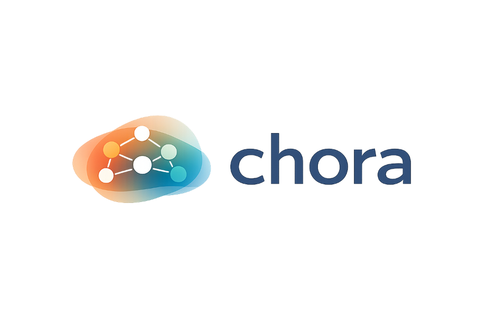

<div align="center">



### The Platial Modelling Operating System

[](https://opensource.org/licenses/MIT)
[](https://www.python.org/downloads/)
[](https://github.com/jameswilliamsresearch/chora)
[](https://jameswilliamsresearch.github.io/chora)
[](https://github.com/jameswilliamsresearch/chora/actions)

**"Place is not a location."**

**Chora** is the first Python library designed to model the **human experience of place**. 
It moves beyond standard GIS (geometry + coordinates) to simulate how places *emerge* from memory, habit, and social interaction.

[Get Started](https://jameswilliamsresearch.github.io/chora/getting_started/) • [Guides](https://jameswilliamsresearch.github.io/chora/guides/) • [API Reference](https://jameswilliamsresearch.github.io/chora/api_reference/)

</div>

---

## ✨ Why Chora?

Standard tools ask: *"What is at Lat/Lon 51.5, -0.1?"*
**Chora** asks: *"Why does this park feel like 'Home' to Alice, but 'Danger' to Bob?"*

| 🧠 Cognitive | 🕰 Temporal | 🕸 Relational |
|:---:|:---:|:---:|
| Models **Familiarity** & **Memory** decay over time. | Places **emerge** and <br> **dissolve** dynamically. | A "Place" is a graph of <br> **Encounters**, not a polygon. |

## 🛠 Features

- **Experiential Physics**: Built-in decay functions (`linear`, `exponential`) simulate how memories fade without reinforcement.
- **Emergent Places**: "Place" is not stored; it is *computed* on-the-fly from the history of interaction.
- **Practice Detection**: Algorithms to detect *Routines*, *Habits*, and *Rituals* from GPS traces.
- **H3 Spatial Indexing**: Hexagonal grids for multi-resolution place analysis.
- **Vibe Search**: Vector embeddings for semantic place similarity.
- **LLM Integration**: Generate place narratives with OpenAI/Anthropic/Ollama.
- **Real-time Streaming**: Process live GPS traces with dwell detection.
- **Graph Native**: Built on Property Graphs, exportable to **Neo4j** and **D3.js**.

---

## ⚡ Quick Start

### Installation
```bash
pip install chora
```

### The "Hello Place" API

```python
from chora.core import PlatialGraph, Agent, SpatialExtent, Encounter, PlatialEdge
from chora.derive import update_familiarity

# 1. Create the world
graph = PlatialGraph("My World")
alice = Agent.individual("Alice")
park = SpatialExtent.from_point(-0.1, 51.5, name="Hyde Park")

# 2. Add to the graph
graph.add_node(alice)
graph.add_node(park)

# 3. Alice visits the park (An Encounter)
visit = Encounter(agent_id=alice.id, extent_id=park.id)
graph.add_node(visit)
graph.add_edge(PlatialEdge.participates_in(alice.id, visit.id))

# 4. Derive Familiarity
fam = update_familiarity(graph, visit)
print(f"Alice's familiarity with Park: {fam.value:.2f}")
# -> "Alice's familiarity with Park: 0.15"
```

---

## 🔍 Vibe Search

Find places by semantic description:

```python
from chora.search import vibe_search

results = vibe_search(graph, "quiet peaceful park for reading")
# Returns: [(park, 0.87), (garden, 0.72), ...]
```

---

## 📚 Documentation

| Guide | Description |
|-------|-------------|
| [GPS to Places](https://jameswilliamsresearch.github.io/chora/guides/gps-to-places/) | Process traces into meaningful places |
| [Affective Mapping](https://jameswilliamsresearch.github.io/chora/guides/affective-mapping/) | Map emotions to locations |
| [Detecting Routines](https://jameswilliamsresearch.github.io/chora/guides/practice-detection/) | Find habits & patterns |
| [Visualization](https://jameswilliamsresearch.github.io/chora/guides/visualization/) | D3.js graphs & reports |
| [H3 Indexing](https://jameswilliamsresearch.github.io/chora/guides/h3-indexing/) | Hexagonal spatial analysis |

---

## 🔮 Roadmap

| Version | Status | Features |
|---------|--------|----------|
| v0.5 | ✅ | Core, Tests, CI/CD, Docs |
| v0.9 | ✅ | CLI, Notebooks, Visualization |
| v1.0 | ✅ | H3, Embeddings, LLM, Streaming |
| v2.0 | 🚧 | Social Physics, Digital Twins |

## 🤝 Contributing

We welcome contributions from Geographers, Developers, and Philosophers.
See [CONTRIBUTING.md](CONTRIBUTING.md) to join the project.

---
<div align="center">
    <i>Built with ❤️ for the Platial Turn.</i>
</div>
