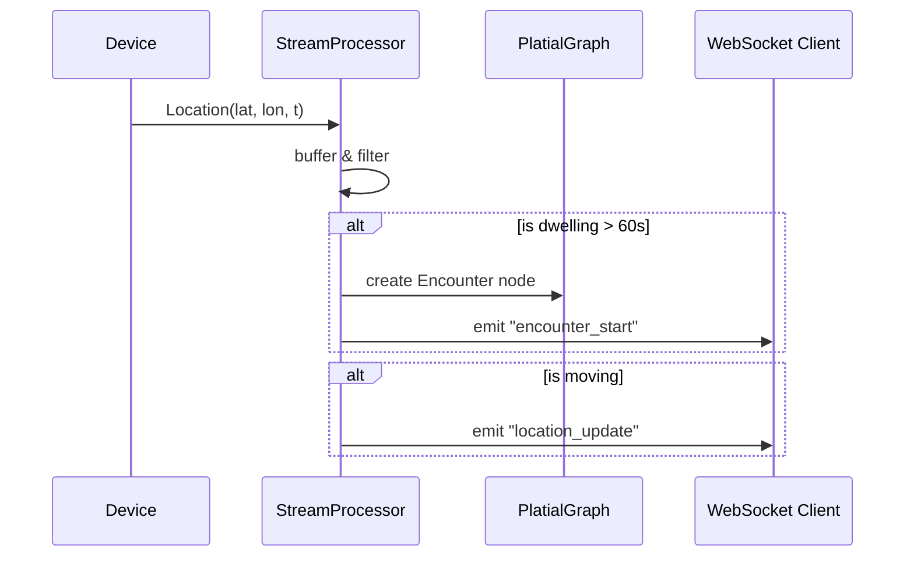

# Real-time Streaming

Process live GPS traces and detect place events in real-time.

---

## Overview

Chora isn't just for static files. The `streaming` module processes infinite streams of location data to:
1. **Detect Dwells** (stopping at a location)
2. **Create Encounters** (logging the visit)
3. **Emit Events** (WebSocket / WebHook)



---

## Basic Usage

### 1. Configure Processor

```python
from chora.streaming import StreamProcessor, StreamConfig

config = StreamConfig(
    dwell_radius_m=25.0,     # Stop within 25m circle
    dwell_time_s=60.0,       # For at least 60 seconds
    min_dwell_for_encounter=120.0  # Log encounter after 2 mins
)

processor = StreamProcessor(graph, config)
```

### 2. Push Events

```python
from chora.streaming import LocationEvent
from datetime import datetime

# Incoming data (e.g. from MQTT, HTTP, Kafka)
raw_point = {"lat": 51.5, "lon": -0.1, "agent": "alice"}

event = LocationEvent(
    agent_id=raw_point["agent"],
    latitude=raw_point["lat"],
    longitude=raw_point["lon"],
    timestamp=datetime.now()
)

# Process returns list of consequential events (if any)
new_events = processor.process(event)

for e in new_events:
    if e.event_type == "encounter":
        print(f"🏠 Alice is at {e.data['extent_id']}")
```

---

## WebSocket Server

Chora includes a WebSocket handler for FastAPI.

```python
# server.py
from fastapi import FastAPI, WebSocket
from chora.streaming import websocket_handler, create_processor

app = FastAPI()
processor = create_processor(graph)

@app.websocket("/ws/stream")
async def stream_endpoint(websocket: WebSocket):
    await websocket.accept()
    await websocket_handler(websocket, processor)
```

**Client Side (JS):**

```javascript
const ws = new WebSocket("ws://localhost:8000/ws/stream");

// Send location
ws.send(JSON.stringify({
  type: "location",
  agent_id: "alice",
  latitude: 51.5074,
  longitude: -0.1278,
  timestamp: new Date().toISOString()
}));

// Listen for place events
ws.onmessage = (event) => {
  const msg = JSON.parse(event.data);
  if (msg.event_type === "encounter") {
    console.log("You visited a place:", msg.data);
  }
}
```

---

## State Management

The processor maintains state for each agent:

```python
state = processor.get_agent_state("alice")

print(f"Current Status: {'Dwelling' if state.dwell_start else 'Moving'}")
if state.dwell_start:
    duration = (now - state.dwell_start).total_seconds()
    print(f"Dwelling for: {duration}s")
```

---

## Next Steps

- [GPS to Places](gps-to-places.md) — Learn about the offline pipeline
- [API Reference](../api_reference.md) — Full streaming API docs
